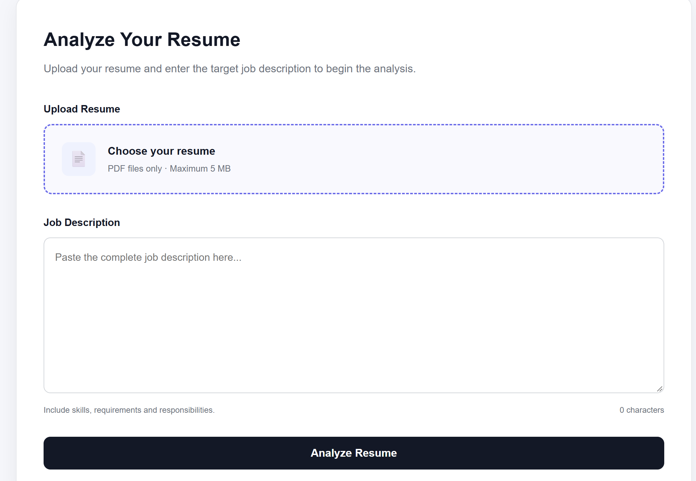
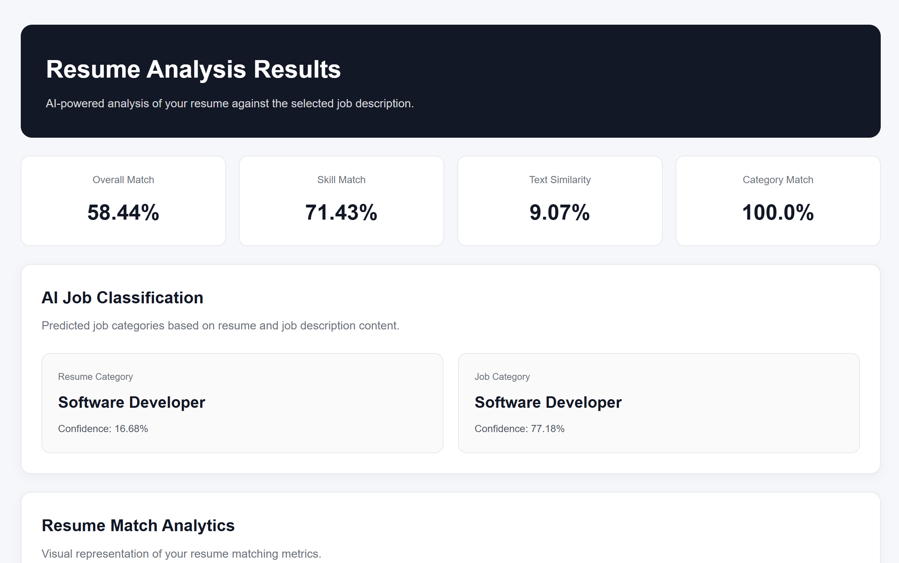
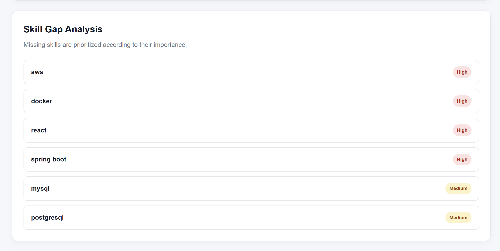
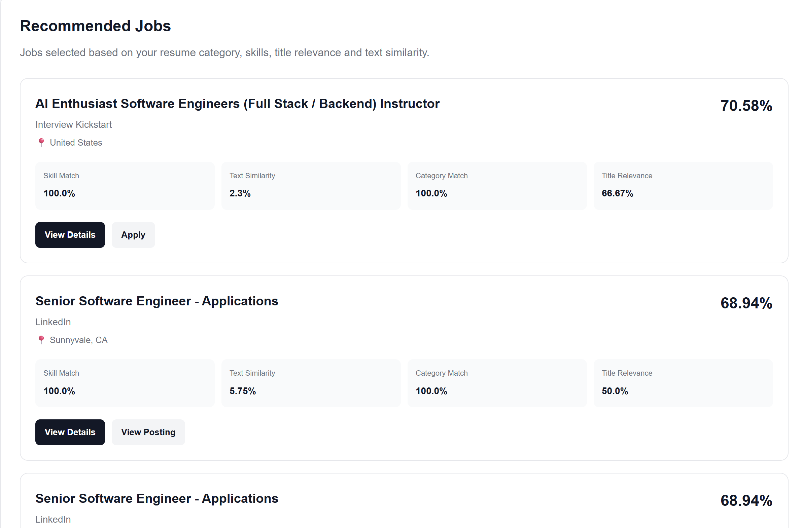
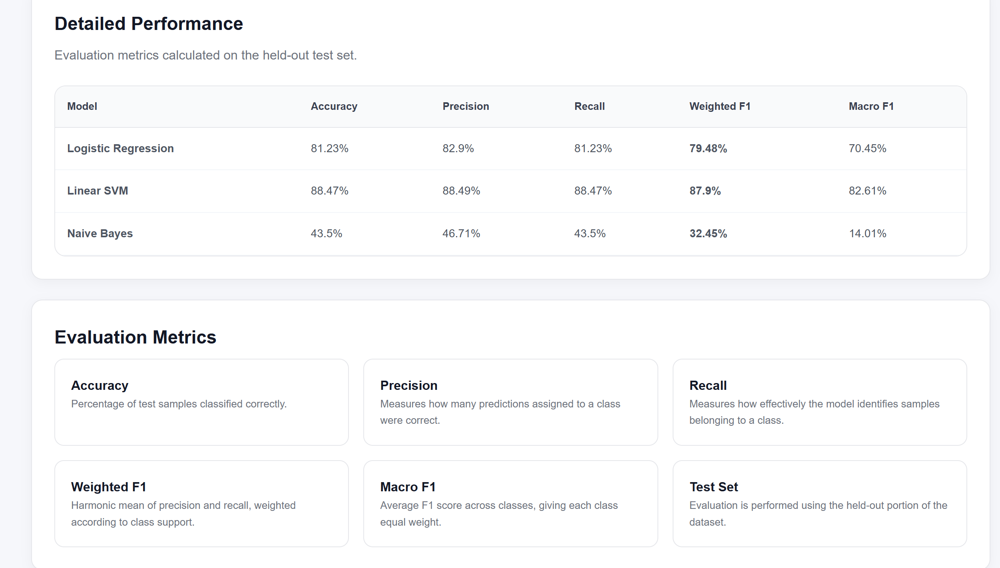

# AI Resume Screening & Job Matching System

An AI-powered web application that analyzes resumes against job descriptions, calculates compatibility scores, identifies skill gaps, classifies job roles using machine learning, and recommends relevant job opportunities.

## 🚀 Key Features

- 📄 **Resume PDF Parsing** – Extracts text from uploaded resumes
- 🔍 **Resume Validation** – Rejects files that do not appear to be resumes
- 🧠 **Job Category Classification** – Predicts the most relevant job category using machine learning
- 📊 **Resume–Job Matching** – Uses TF-IDF and cosine similarity
- 🛠️ **Skill Matching** – Identifies matched and missing skills
- 📈 **Skill Gap Analysis** – Prioritizes missing skills
- 🎯 **Skill Recommendations** – Suggests learning resources for missing skills
- 💼 **Job Recommendations** – Recommends relevant jobs from the dataset
- 📚 **Learning Roadmap** – Provides recommendations based on skill gaps
- 📋 **Analysis History** – Stores previous analyses using SQLite
- 📊 **Model Performance Dashboard** – Compares multiple machine-learning models
- 🔗 **Job Details** – Displays job information and application links

## 🧠 Machine Learning

The system evaluates three text-classification models:

| Model | Accuracy | Weighted F1 |
|---|---:|---:|
| Logistic Regression | 85.63% | 85.63% |
| Linear SVM | 88.37% | 88.09% |
| Multinomial Naive Bayes | 59.73% | 50.24% |

The deployed classifier uses **Linear SVM with TF-IDF features**.

> **Note:** Job-category labels were generated using title-based heuristic rules from the dataset. Therefore, the reported metrics measure agreement with those derived labels rather than independently verified industry labels.

## 🖥️ Application Screenshots

### Resume Analysis



### Analysis Results



### Skill Gap Analysis



### Job Recommendations



### Model Performance



## 🛠️ Technology Stack

**Backend**
- Python
- Flask

**Machine Learning**
- Scikit-learn
- TF-IDF
- Linear SVM
- Logistic Regression
- Multinomial Naive Bayes

**Data Processing**
- NumPy
- SciPy
- Python CSV

**Document Processing**
- pypdf

**Database**
- SQLite

**Frontend**
- HTML5
- CSS3
- JavaScript

**Tools**
- Git
- GitHub
- VS Code

## 🏗️ System Architecture

```text
                    ┌─────────────────────┐
                    │     User Resume     │
                    │       PDF           │
                    └──────────┬──────────┘
                               │
                               ▼
                    ┌─────────────────────┐
                    │   Resume Parser     │
                    └──────────┬──────────┘
                               │
                               ▼
                    ┌─────────────────────┐
                    │ Resume Validation   │
                    └──────────┬──────────┘
                               │
                               ▼
              ┌────────────────────────────────┐
              │        Text Processing         │
              │       + Skill Extraction       │
              └───────────────┬────────────────┘
                              │
             ┌────────────────┼────────────────┐
             ▼                ▼                ▼
      ┌─────────────┐ ┌─────────────┐ ┌──────────────┐
      │ TF-IDF      │ │ Job Category │ │ Skill Gap    │
      │ Similarity  │ │ Classifier   │ │ Analysis     │
      └──────┬──────┘ └──────┬──────┘ └──────┬───────┘
             │               │               │
             └───────────────┼───────────────┘
                             ▼
                    ┌─────────────────────┐
                    │ Final Match Score   │
                    └──────────┬──────────┘
                               │
                               ▼
                    ┌─────────────────────┐
                    │ Results Dashboard   │
                    └─────────────────────┘